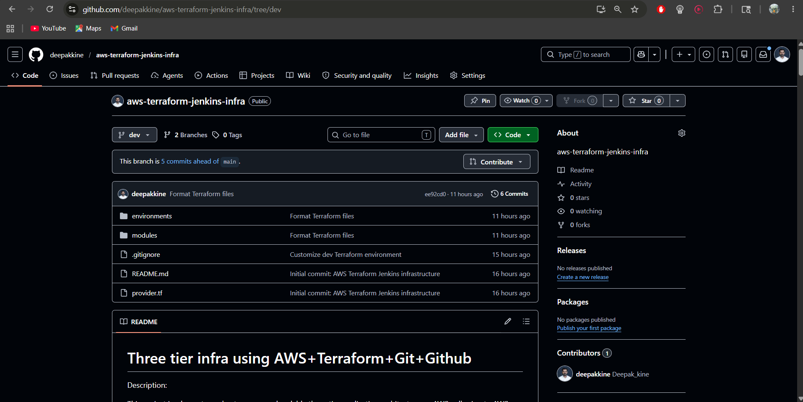
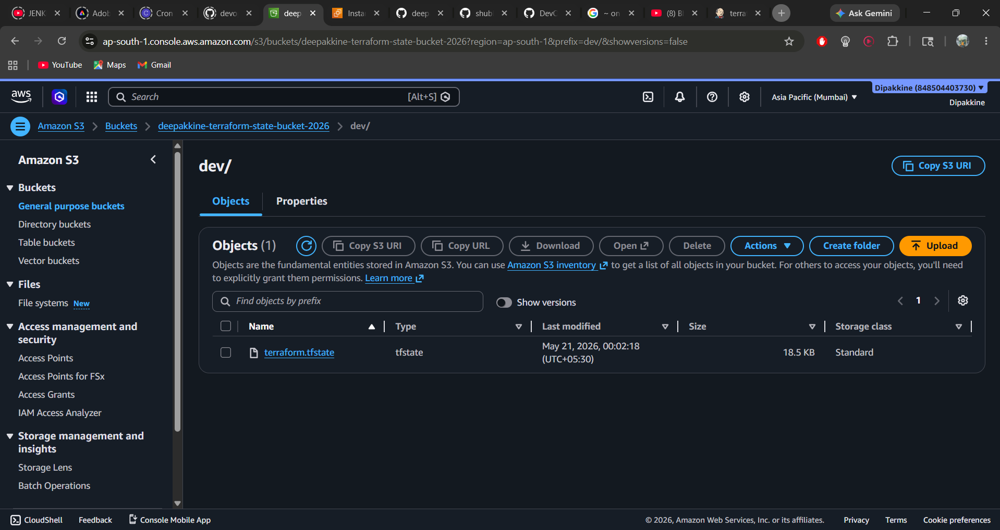
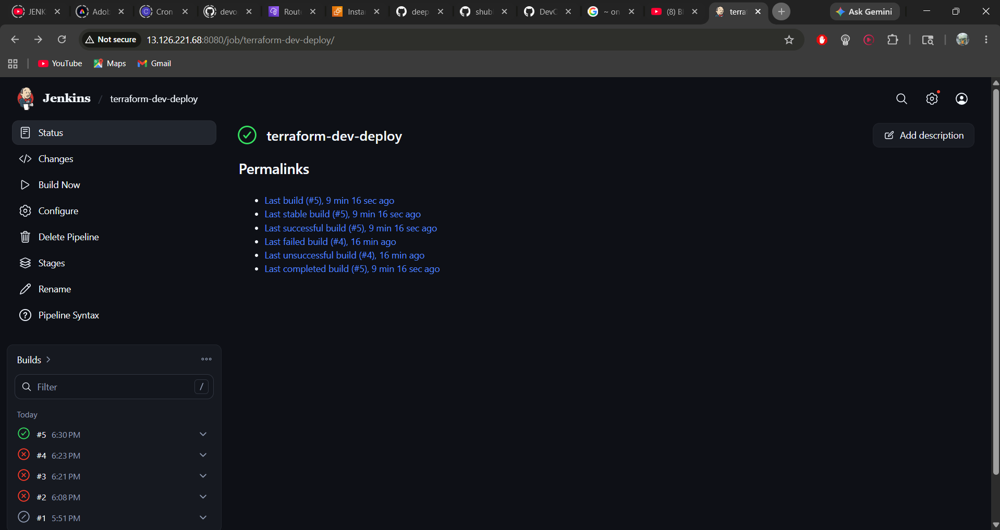
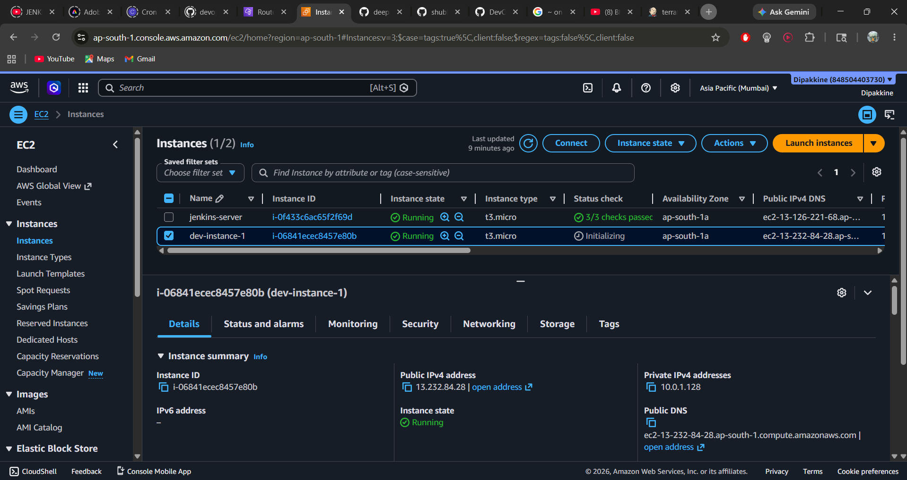
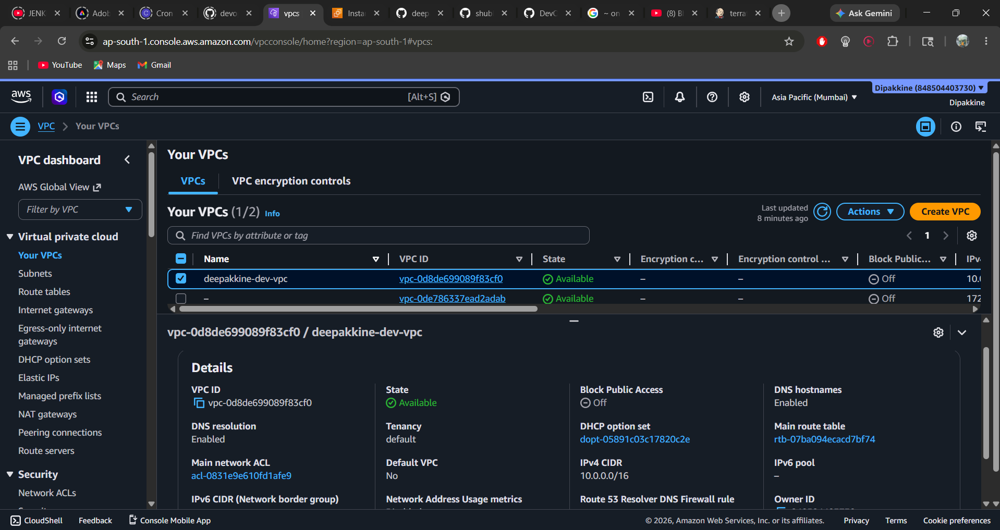
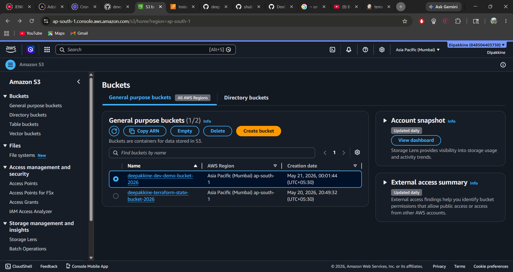
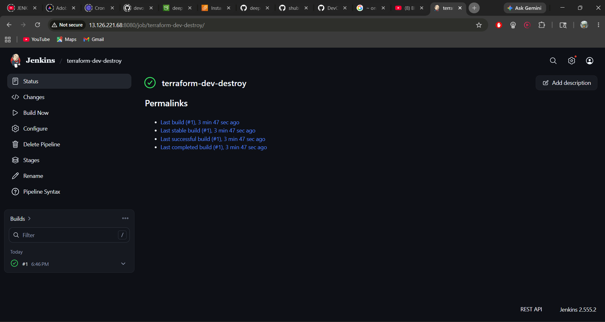

# AWS Infrastructure Automation with Terraform and Jenkins

This project provisions AWS infrastructure using Terraform and automates deployment through a Jenkins CI/CD pipeline. Jenkins pulls Terraform code from the GitHub `dev` branch, runs Terraform commands, and stores Terraform state remotely in an S3 backend.

## Tech Stack

- AWS
- Terraform
- Jenkins
- GitHub
- S3 Remote Backend
- EC2
- VPC
- Ubuntu

## Project Flow

```text
GitHub dev branch
        ↓
Jenkins Pipeline
        ↓
Terraform Init / Validate / Plan / Apply
        ↓
AWS Infrastructure Created
        ↓
Terraform State Stored in S3
```

## GitHub Repository

The project code is maintained in my own GitHub repository on the `dev` branch. Jenkins pulls this branch during pipeline execution.



## Repository Setup

```bash
git clone https://github.com/shubhamjain-tech/Aws-infra-terraform-jenkins.git
cd Aws-infra-terraform-jenkins

rm -rf .git
git init
git branch -M main
git add .
git commit -m "Initial commit: AWS Terraform Jenkins infrastructure"

git remote add origin https://github.com/deepakkine/aws-terraform-jenkins-infra.git
git push -u origin main

git checkout -b dev
git push -u origin dev
```

## Terraform Local Testing

The actual Terraform environment is inside `environments/dev`.

```bash
cd environments/dev
terraform init
terraform validate
terraform plan
```

Initially, Terraform showed no changes from the root folder because the root folder did not contain the actual environment resources.

## Terraform Fixes and Customization

The AWS provider version was pinned in `environments/dev/provider.tf`.

```hcl
terraform {
  required_providers {
    aws = {
      source  = "hashicorp/aws"
      version = "~> 5.0"
    }
  }
}

provider "aws" {
  region = "ap-south-1"
}
```

The old Elastic IP syntax was fixed in `modules/vpc/main.tf`.

```hcl
domain = "vpc"
```

The dev environment was reduced to avoid unnecessary AWS charges:

- 1 EC2 instance
- 1 S3 bucket
- NAT Gateway removed
- Remote backend enabled with S3

## S3 Remote Backend Setup

A backend bucket was created for Terraform state.

```bash
aws s3api create-bucket \
  --bucket deepakkine-terraform-state-bucket-2026 \
  --region ap-south-1 \
  --create-bucket-configuration LocationConstraint=ap-south-1
```

Versioning was enabled on the backend bucket.

```bash
aws s3api put-bucket-versioning \
  --bucket deepakkine-terraform-state-bucket-2026 \
  --versioning-configuration Status=Enabled
```

Backend configuration in `environments/dev/backend.tf`:

```hcl
terraform {
  backend "s3" {
    bucket  = "deepakkine-terraform-state-bucket-2026"
    key     = "dev/terraform.tfstate"
    region  = "ap-south-1"
    encrypt = true
  }
}
```

Terraform was reinitialized with the backend.

```bash
cd environments/dev
terraform init -reconfigure
terraform validate
terraform plan
```

## Terraform Remote State

Terraform state is stored remotely in an S3 backend. This allows Jenkins and local Terraform commands to use the same state file.



## Git Commit and Push

```bash
terraform fmt -recursive .
git status
git add .
git commit -m "Customize dev Terraform environment"
git push origin dev
```

## Jenkins Server Setup

A `t3.micro` EC2 instance was launched for Jenkins.

Security group rules:

```text
SSH 22 from My IP
Jenkins 8080 from My IP
```

SSH into Jenkins server:

```bash
ssh -i ./project_key.pem ubuntu@<jenkins-public-ip>
```

Swap was added because Jenkins needs more memory.

```bash
sudo fallocate -l 2G /swapfile
sudo chmod 600 /swapfile
sudo mkswap /swapfile
sudo swapon /swapfile
echo '/swapfile none swap sw 0 0' | sudo tee -a /etc/fstab
free -h
```

## Jenkins Installation

```bash
sudo apt update
sudo apt install -y fontconfig openjdk-21-jre wget gpg unzip
```

Jenkins repository key was added.

```bash
sudo mkdir -p /etc/apt/keyrings

sudo wget -O /etc/apt/keyrings/jenkins-keyring.asc \
  https://pkg.jenkins.io/debian-stable/jenkins.io-2026.key

echo "deb [signed-by=/etc/apt/keyrings/jenkins-keyring.asc] https://pkg.jenkins.io/debian-stable binary/" | \
  sudo tee /etc/apt/sources.list.d/jenkins.list > /dev/null
```

Install and start Jenkins:

```bash
sudo apt update
sudo apt install -y jenkins

sudo systemctl enable jenkins
sudo systemctl start jenkins
sudo systemctl status jenkins
```

Initial Jenkins password:

```bash
sudo cat /var/lib/jenkins/secrets/initialAdminPassword
```

Jenkins URL:

```text
http://<jenkins-public-ip>:8080
```

## Install Terraform on Jenkins Server

```bash
sudo apt update
sudo apt install -y unzip curl gnupg software-properties-common

wget -O - https://apt.releases.hashicorp.com/gpg | \
  sudo gpg --dearmor -o /usr/share/keyrings/hashicorp-archive-keyring.gpg

echo "deb [signed-by=/usr/share/keyrings/hashicorp-archive-keyring.gpg] https://apt.releases.hashicorp.com $(. /etc/os-release && echo "$VERSION_CODENAME") main" | \
  sudo tee /etc/apt/sources.list.d/hashicorp.list

sudo apt update
sudo apt install -y terraform
terraform version
```

## Install AWS CLI on Jenkins Server

```bash
curl "https://awscli.amazonaws.com/awscli-exe-linux-x86_64.zip" -o "awscliv2.zip"
unzip awscliv2.zip
sudo ./aws/install
aws --version
```

AWS credentials were configured for the Jenkins server.

```bash
aws configure
```

Jenkins user access was tested.

```bash
sudo -u jenkins terraform version
sudo -u jenkins aws --version
sudo -u jenkins aws sts get-caller-identity
```

> Note: For production usage, attaching an IAM role to the Jenkins EC2 instance is recommended instead of storing access keys on the server.

## Jenkins Disk Issue Fix

The Jenkins node went offline due to low disk space. The EBS volume was increased to 20 GB, then the filesystem was expanded.

```bash
lsblk
sudo growpart /dev/nvme0n1 1
sudo resize2fs /dev/nvme0n1p1
df -h
```

Jenkins also had low `/tmp` space, so a Jenkins temp directory was configured.

```bash
sudo mkdir -p /var/lib/jenkins/tmp
sudo chown jenkins:jenkins /var/lib/jenkins/tmp

sudo mkdir -p /etc/systemd/system/jenkins.service.d

sudo tee /etc/systemd/system/jenkins.service.d/override.conf > /dev/null <<'EOF'
[Service]
Environment="JAVA_OPTS=-Djava.io.tmpdir=/var/lib/jenkins/tmp"
EOF

sudo systemctl daemon-reload
sudo systemctl restart jenkins
sudo systemctl show jenkins --property=Environment
```

## Jenkins CI/CD Pipeline

A Jenkins pipeline was created to automate the Terraform deployment workflow. The pipeline pulls code from GitHub, initializes Terraform, validates the code, creates a plan, and applies the infrastructure changes.

## Jenkins Pipeline as Code

This repository includes Jenkins pipeline files so the deployment and destroy workflows are version-controlled with the Terraform code.

| File | Purpose |
|------|---------|
| `Jenkinsfile.deploy` | Runs Terraform init, format check, validate, plan, and apply |
| `Jenkinsfile.destroy` | Runs Terraform init and destroy to remove AWS resources |

These files can be used in Jenkins by selecting:

```text
Pipeline script from SCM
```

Deploy job configuration:

```text
Repository URL: https://github.com/deepakkine/aws-terraform-jenkins-infra.git
Branch: dev
Script Path: Jenkinsfile.deploy
```

Destroy job configuration:

```text
Repository URL: https://github.com/deepakkine/aws-terraform-jenkins-infra.git
Branch: dev
Script Path: Jenkinsfile.destroy
```

Jenkins job name:

```text
terraform-dev-deploy
```



## Jenkins Deploy Pipeline Script

```groovy
pipeline {
    agent any

    environment {
        AWS_DEFAULT_REGION = 'ap-south-1'
    }

    stages {
        stage('Checkout Code') {
            steps {
                git branch: 'dev', url: 'https://github.com/deepakkine/aws-terraform-jenkins-infra.git'
            }
        }

        stage('Terraform Init') {
            steps {
                sh '''
                cd environments/dev
                terraform init -reconfigure
                '''
            }
        }

        stage('Terraform Format Check') {
            steps {
                sh '''
                cd environments/dev
                terraform fmt -check -recursive ../..
                '''
            }
        }

        stage('Terraform Validate') {
            steps {
                sh '''
                cd environments/dev
                terraform validate
                '''
            }
        }

        stage('Terraform Plan') {
            steps {
                sh '''
                cd environments/dev
                terraform plan -out=tfplan
                '''
            }
        }

        stage('Terraform Apply') {
            steps {
                sh '''
                cd environments/dev
                terraform apply -auto-approve tfplan
                '''
            }
        }
    }

    post {
        success {
            echo 'Terraform dev infrastructure deployed successfully.'
        }
        failure {
            echo 'Terraform dev deployment failed. Check console output.'
        }
    }
}
```

## AWS Infrastructure Created

After the Jenkins deployment pipeline completed successfully, Terraform created the required AWS resources.

### EC2 Instance

Terraform created a development EC2 instance in the `ap-south-1` region.



### VPC

Terraform created a custom VPC for the development environment.



### S3 Buckets

Two S3 buckets were used in this project:

- One S3 bucket for demo infrastructure
- One S3 bucket for Terraform remote state



## Jenkins Destroy Pipeline

A separate Jenkins destroy pipeline was created to remove the infrastructure after testing and avoid unnecessary AWS charges.

Jenkins job name:

```bash
terraform-dev-destroy
```



## Jenkins Destroy Pipeline Script

```groovy
pipeline {
    agent any

    environment {
        AWS_DEFAULT_REGION = 'ap-south-1'
    }

    stages {
        stage('Checkout Code') {
            steps {
                git branch: 'dev', url: 'https://github.com/deepakkine/aws-terraform-jenkins-infra.git'
            }
        }

        stage('Terraform Init') {
            steps {
                sh '''
                cd environments/dev
                terraform init -reconfigure
                '''
            }
        }

        stage('Terraform Destroy') {
            steps {
                sh '''
                cd environments/dev
                terraform destroy -auto-approve
                '''
            }
        }
    }

    post {
        success {
            echo 'Terraform dev infrastructure destroyed successfully.'
        }
        failure {
            echo 'Terraform dev destroy failed. Check console output.'
        }
    }
}
```

## Screenshots

Screenshots are stored in the `screenshots/` folder.

```bash
screenshots/github-dev-branch.png
screenshots/jenkins-deploy-success.png
screenshots/aws-ec2-instance.png
screenshots/aws-vpc.png
screenshots/aws-s3-buckets.png
screenshots/s3-terraform-state.png
screenshots/jenkins-destroy-success.png
```

## Final Result

The Jenkins pipelines successfully automated the full lifecycle of AWS infrastructure using Terraform, from deployment to destruction. Terraform state was stored in an S3 backend, and both deployment and destroy operations were managed through Jenkins CI/CD.

## Important Note

Resources should be destroyed after testing to avoid AWS charges.

```bash
terraform destroy
```
